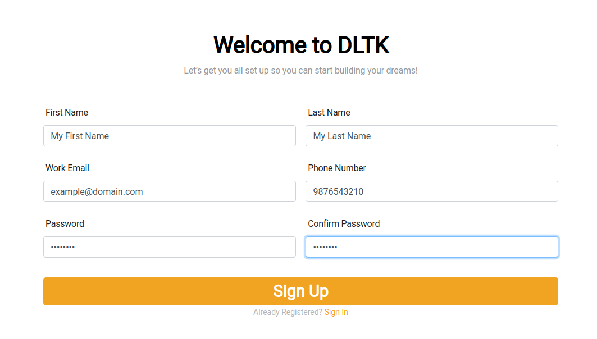
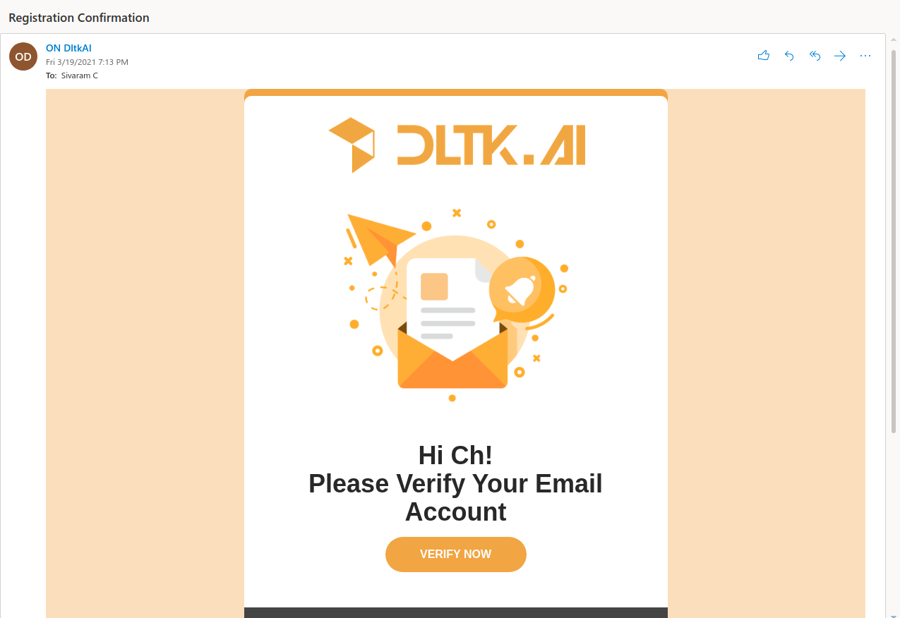
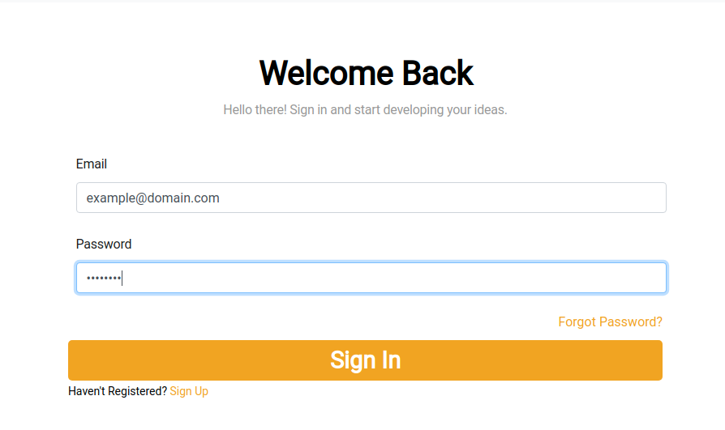
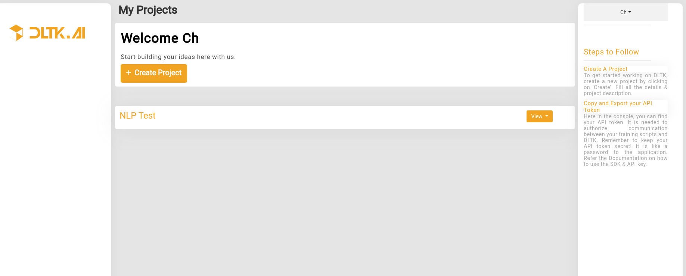
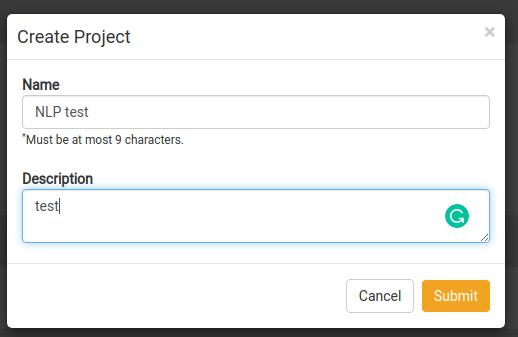
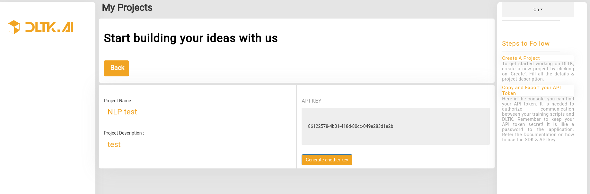

********************************
Create user and Generate APIkey
********************************

.. contents:: Table of Contents
    :depth: 4
    :local:

Depending on where OpenDLTK is deployed, you need to follow steps for either local or server machine IP address

.. tab:: local

    The UI for user creation can be accessed at `http://localhost:8082 <http://localhost:8082>`__ ,by clicking on **Sign Up** button on top right, user will be able to view below pages

.. tab:: server

    The UI for user creation can be accessed at `http://BASE_SERVICE_IP:8082 <http://BASE_SERVICE_IP:8082>`__ ,by clicking on **Sign Up** button on top right, user will be able to view below pages

    It's recommended to map DNS name to BASE_SERVICE_IP:8082

Sign Up
=============================

After filling above details, click on **Sign Up** button.
User will receive an e-mail for verification. On successful verification of email, user will be redirected to **Sign In** page.

Email Verification
=============================
User will receive a verification email, as shown below, you need to click on ``Verify Now`` button to verify your email address.

Sign in
=============================
Next Step is to sign in using the credentials provided while Sign Up process

Create a project
=============================

After successful login, user will be able to view project list page

Next user needs to create a project, by giving details as shown in below image

Get an API key
=============================

After successful creation of project, you can go to Project Details Page to get `API Key`

Use API Key in SDK client initialization
==========================================

Using above generated API key you can use in python SDK client

.. code-block::

        import dltk_ai

        client = dltk_ai.DltkAiClient('86122578-4b01-418d-80cc-049e283d1e2b', base_url='http://localhost:8000')

        text = "The product is very easy to use and has got a really good life expectancy."

        sentiment_analysis_response = client.sentiment_analysis(text)

        print(sentiment_analysis_response.text)

**Expected Output:**

.. code-block::

        {
          "spacy": {"emotion": "POSITIVE", "scores": {"negative": 0.0, "neutral": 0.653, "positive": 0.347, "compound": 0.7496}}
        }
