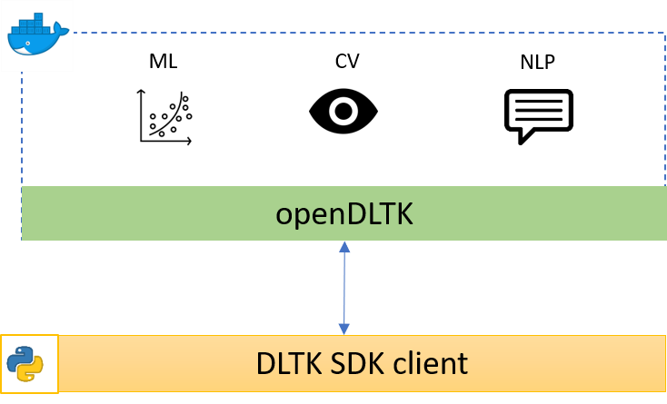

**********
About DLTK
**********

DLTK is an enterprise-ready cloud platform that offers self-service AI capabilities.

******************************
OpenDLTK and Python SDK client
******************************

DLTK comprises of **OpenDLTK** where processing of images, text or structured tabular data is done using state-of-the-art AI models,
and another component is **python client sdk** which can be used for integration of these AI services in your projects.

OpenDLTK
========

        OpenDLTK is collection of open-source docker images which can be deployed on single or multiple instances.

        Functional Architecture Diagram

        .. image:: images/architecture_diagram.png
            :align: center
            :alt: Functional Architecture Diagram
            :width: 900

        **Description:**

        1. Kong API Gateway
              All user request are received by kong, which further directs to right microservice in OpenDLTK

        2. Base Service
            It comprises of `Solution Service, Registry service and Database Migrations` Docker Containers, which are responsible for interacting with supported File storage services
            and Databases along with managing .

        3. Storage Services
            OpenDLTK supports AWS S3, Google Cloud Storage and Digital Ocean SPACES, along with Local Disk storage where Base services are deployed.

        4. Machine Learning Services
            a. ML Wrapper
                It parse user request parameters

            b. ML Scikit
                This Microservice uses widely used `Scikit <https://scikit-learn.org/stable/>`__ package for training and evaluating classification, regression, clustering models and other ML related tasks on dataset provided by user.

            c. ML H2O
                This Microservice uses `H2O.ai <https://www.h2o.ai/>`__ python SDK for training and evaluating classification, regression, clustering models and other ML related tasks on dataset provided by user.

            d. ML Weka

        Natural Language Processing
            This microservice provides features like Sentiment analysis, Name Entity Recognition, Tag Extraction using widely used ``Spacy`` and `NLTK` package. It also provide support for various AI engines like Azure & IBM.

        Computer Vision
            a. CV Wrapper
                This microservice receives images provided by user and route to right service based on the feature requested by them.

            b. Image Classification
                This microservice classi

        .. seealso::

            For more details on OpenDLTK you can refer following documentation

            - :ref:`OpenDLTK Setup Guide <openDLTK-setup>`
            - `OpenDLTK docker Hub <https://hub.docker.com/repositories>`__
            - `OpenDLTK github <https://github.com/dltk-ai/openDLTK>`__

Python Client SDK
=================

        OpenDLTK containers can be used either using REST APIs or using ``qubitai-dltk`` python client sdk, which simplify usage of the cognitive services provided by OpenDLTK.

        .. seealso::

            - `Python Client SDK Github Code <https://github.com/dltk-ai/qubitai-dltk>`__
            - :ref:`Installation Guide <python-sdk-installation>`
